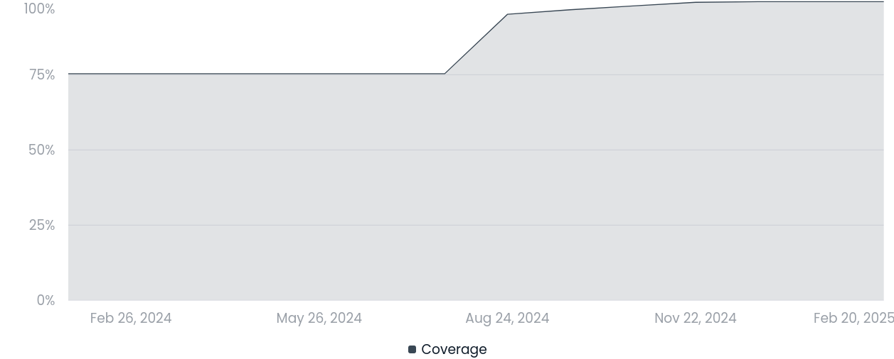

We are happy to announce that the [Luminescence R package][lumi] has finally
reached **version 1.0.0**. This is an important milestone, not only in the
history of the Luminescence package, but also for the REPLAY project.

This makes it the third release since the start of the REPLAY project:

- [Version 0.9.25][rel925] was released in September 2024, just over a month
into the project, and it already contained a large number of changes
(422 commits)

- [Version 0.9.26][rel926] was a minor release (73 commits) to fix a couple of
small regressions that we didn't want to affect our [first REPLAY webinar][webin1]

- [Version 1.0.0][rel100] contains most of the work that has occurred between
September and February (886 commits) in a number of key areas, which we'll
outline below.

<!--more-->

### Testing and coverage

One of the first areas of focus of our work was to enhance testing and
coverage of the package. Testing allows to record what the expected behaviour
of any function is, so that no unintented changes should go unnoticed.
Coverage measures how many lines of code are reached by tests: the higher the
coverage, the more confidence we have that tests are able to exercise all
parts of the code. Therefore improving testing and coverage go hand in hand.

Code coverage went from 76.3% (v0.9.24) to 95% (v0.9.25) to 99.2% (v1.0.0).
As of now there are only 202 uncovered lines out of 27865 in the whole
package. Most of them are rare error conditions that are quite hard to
find examples for, or that depend on lack of numerical convergence in some
fitting procedure.

In order to achieve that, we more than doubled the number of tests in the
package (from 1273 in v0.9.24 to 2897 in v1.0.0). But the improvement is not
limited to the sheer number of tests: we introduced [snapshot tests][snaps],
which allow to compare numerical and graphical output of a function against
reference results. At the moment we have snapshots for 33 functions, but
this work will continue in the future with a stronger focus on the graphical
tests ([issue 243][iss243]).

### Input validation and fuzz testing

We also payed attention to input validation and error reporting. Now the
package is a bit stricter in what it accepts. This brings a number of
advantages:

- when a function is called with the wrong argument type, it will return a
clear error rather than a mysterious message from some base R function

- the error reported use some standardized internal validation functions, so
that the thoroughness of the checks and the error messages reported are
consistent throughout the package

- as these check occur at the beginning of each function, they normally
appear very quickly, rather than after expensive and time-consuming operations

- having function arguments validated at the beginning allows for the rest
of the code to trust the values it receives, so the code can sometimes be
simplified a bit.

As a way to help us find which functions could have their validation steps
improved, we started developing the experimental [CBFT package][cbtf]. This
implements [a simple fuzz testing approach][fuzz] which allows to call all functions
of a package with any sort of inputs and see what failures are produced. This
is still ongoing work and is being tracked in [issue 439][iss439].

### Performance improvements

With greater testing available, we could start making more invasive changes
to the package functions with no fear of introducing new bugs or regressing
the expected behaviour. In most cases, these changes produced only minor
performance improvements, however three functions were worked on more
intensely and lead to visible speed-ups.

Function `read_BIN2R()` has always been a frustrating one to use, feeling
too slow for large files. We tackled this problem in [issue 298][iss298],
where we obtained a 50% improvement when reading a 46M BINX file, which will
be even larger for larger BIN/BINX files. Along the way we fixed a number of
corner cases which should make the package more resilient when reading
malformed or anyway unusual files.

Another problematic area was in the vertical sliding algorithm of
`analyse_IRSAR.RF()`. In [issue 372][iss372] we noticed that in our C++
implementation a double vector lookup was done within an inner loop while
it could be done outside of that loop. This alone helped cut ~20s on a test
file we were using (from ~55s to ~32s). Furthermore, after looking at the
code in detail, we realised that a step of the vertical sliding was performed
across 10 windows of growing size, the first of which was definitely too
small to be of any value. Therefore we fixed how such window sizes were
defined, let the number of windows to be user-controlled (via the new
`num_slide_windows` option for the `method_control` argument), and changed
the default from 10 to 3 windows. This brought down the execution time to
11s, that is 5 times faster that before, without any noticeable degradation
in the quality of the solution.

A last sizeable improvement occurred for function  `calc_Huntley2006()` in
[issue 258][iss258]. Also in this case there were computations that were
performed repeatedly in a loop (using `mapply()` this time), while they could
be performed just once as they were independent of the loop variables. We
also noticed that the number of points tested for `rho'` was strangely
dependent on the number of Monte Carlo iterations required: this didn't make
much sense, so we changed the default to 1000 equally-spaced points in the
interval [0, 3] (and added option `rprime` to let the user override it if
required). Overall we got a 4x speed-up when running a test file for 50,000
MC iterations (from ~230s to ~62s).

### The road ahead

Having accomplished the first milestone for the REPLAY project, now the
focus will move on to other areas, mainly on the design and development of
an interactive graphical interface to facilitate the use of the Luminescence
package. While work on maintenance and improvement of the package will
continue, we expect to have far fewer changes (in particular breaking changes)
than before.

As always, bug reports are very welcome, in particular if you spot regression
or performance problems. And if you'd like to contribute new functionalities
or bug fixes, check out our [guidelines for contributors][contr].

[lumi]:   https://r-lum.github.io/Luminescence/
[rel925]: https://github.com/R-Lum/Luminescence/releases/tag/v0.9.25
[rel926]: https://github.com/R-Lum/Luminescence/releases/tag/v0.9.26
[rel100]: https://github.com/R-Lum/Luminescence/releases/tag/v1.0.0
[webin1]: https://r-luminescence.org/news/20241130_replay_webinar_112024/
[snaps]:  https://testthat.r-lib.org/articles/snapshotting.html
[cbtf]:   https://github.com/mcol/caught-by-the-fuzz
[fuzz]:   
[iss243]: https://github.com/R-Lum/Luminescence/issues/243
[iss258]: https://github.com/R-Lum/Luminescence/issues/258
[iss298]: https://github.com/R-Lum/Luminescence/issues/298
[iss372]: https://github.com/R-Lum/Luminescence/issues/372
[iss439]: https://github.com/R-Lum/Luminescence/issues/439
[contr]:  https://github.com/R-Lum/Luminescence/blob/master/CONTRIBUTING.md
