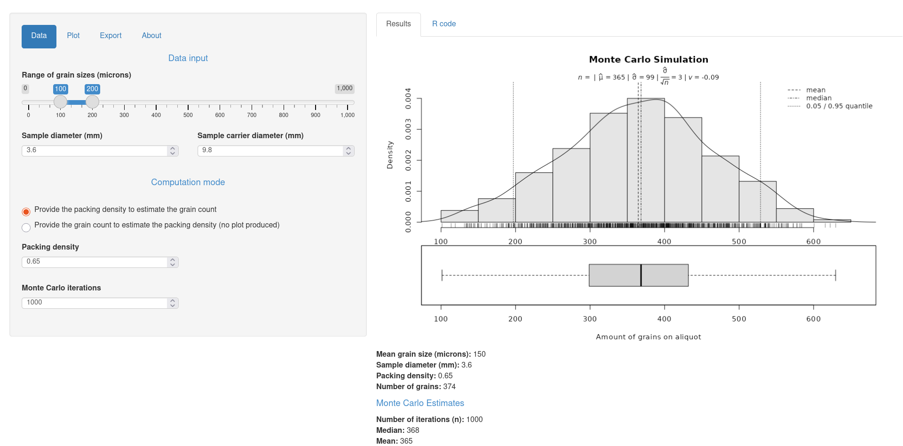
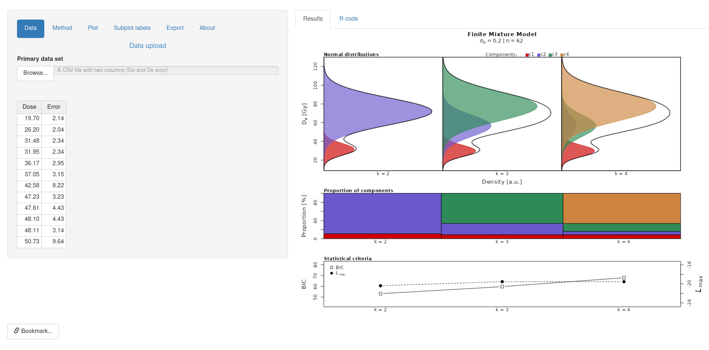
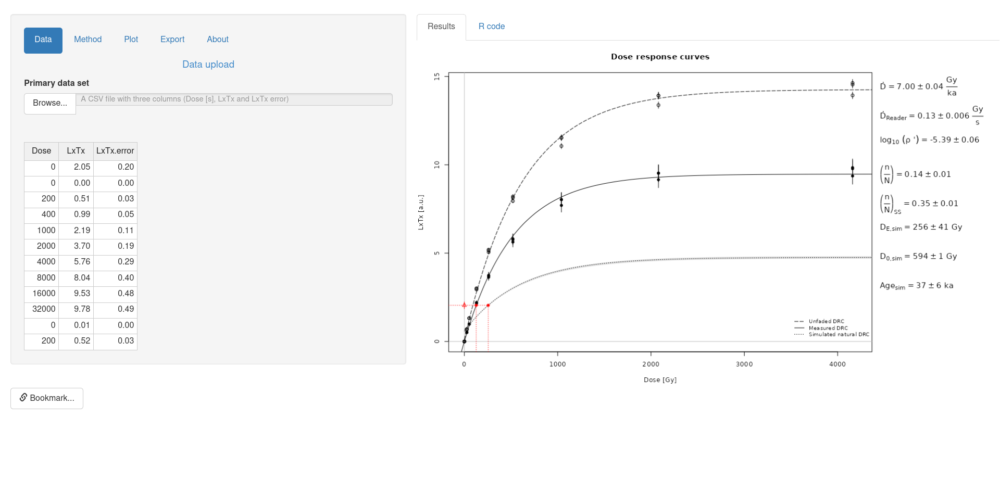
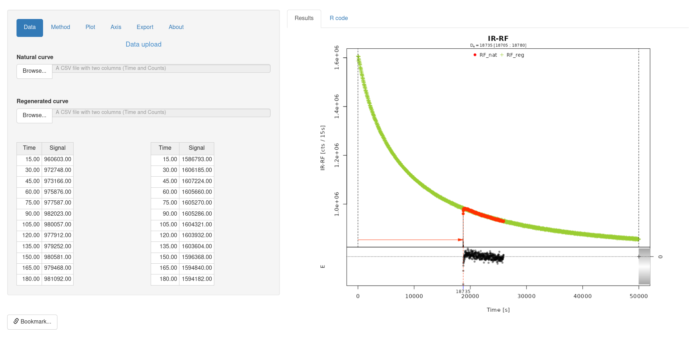
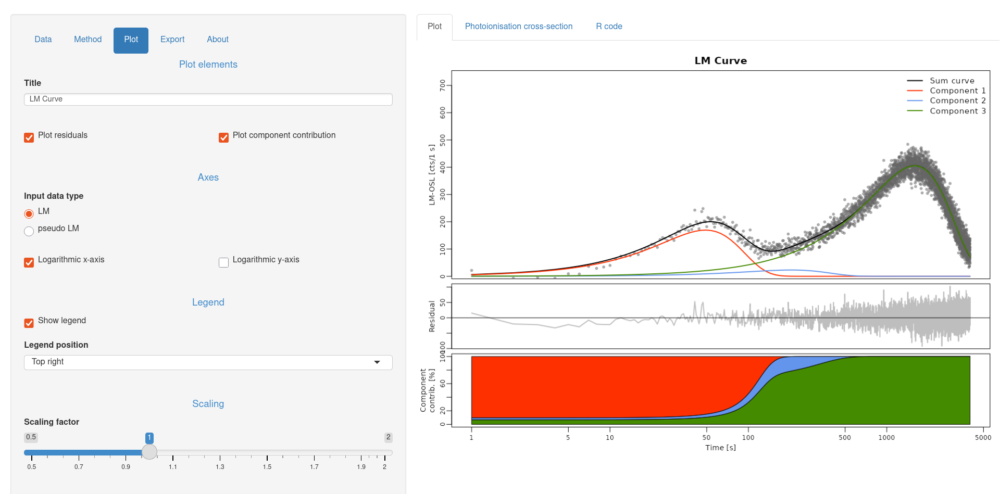

Much of the work that took place during the [Luminescence 1.1.0 timeframe][v110]
was devoted to adding new features to [RLumShiny][rlshiny], the graphical
interface to `Luminescence` built on the [Shiny framework][shiny]. We see this
package as a good entry point to become acquainted with some of the functions
provided by `Luminescence` and their various options.

Our work for the [RLumShiny 0.2.5 release][rls025] concentrated on adding a
bunch of new apps:

* `aliquotsize` to either estimate the number of grains on an aliquot or to
compute the packing density (based on `calc_AliquotSize()`);

* `finitemixture` to fit a k-component mixture to a De distribution with
differing known standard errors (based on `calc_FiniteMixture()`);

* `huntley2006` to calculate the expected sample specific fraction of
saturation based on the model of Huntley (2006), using the approach as
implemented in Kars et al. (2008) or Guralnik et al. (2015) (based on
`calc_Huntley2006()`);

* `irsarRF` to analyse IRSAR RF measurements on K-feldspar samples performed
using the protocol according to Erfurt et al. (2003) and beyond (based on
`analyse_IRSAR.RF()`);

* `lmcurve` to determine weighted non-linear least-squares estimates of the
component parameters of an LM-OSL curve (Bulur 1996) for a given number of
components (based on `fit_LMCurve()`).

This phase work made us realise something that we had not fully appreciated
until then: `RLumShiny` is a great tool for developers. Indeed, the graphical
interface makes it a breeze to test out various combinations of function
arguments, and this led to discover quite a number of
[cosmetic bugs in `Luminescence`][bugs] (also a few crashes), and various
cases in which `Luminescence` was not as flexible as it could be.

Our future plans for `RLumShiny` contemplate adding a few more apps, but
specifically a way of facilitating data input and subsetting within the
graphical interface. While some building blocks are already available in the
package (although they are not exposed to the users), there is still quite a
bit of work to be done. That will be exciting and challenging at the same
time, but it is an important step to make `RLumShiny` a viable tool also for
the advanced data analyst.

We hope that [RLumShiny 0.2.5][rls025] will be embraced by many people, both
well-experienced users and those at their initial steps with luminescence-based
analyses. We are also keen to hear of bugs or annoyances you may encounter!

[rlshiny]: https://tzerk.github.io/RLumShiny/
[shiny]:   https://shiny.posit.co/
[rls025]:  https://github.com/tzerk/RLumShiny/releases/tag/v0.2.5
[v110]:    
[bugs]:    https://github.com/R-Lum/Luminescence/issues?q=state%3Aclosed%20label%3ARLumShiny%20milestone%3Av1.1.0
