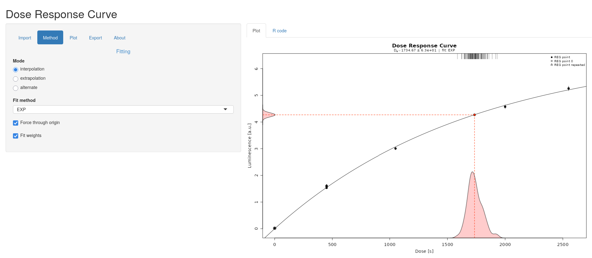
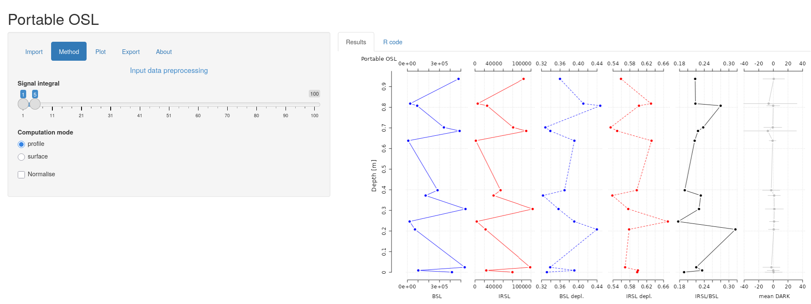
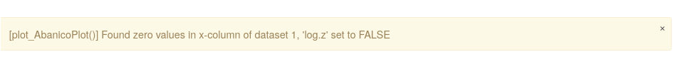

It has been a while since [our previous update][rls025] concerning
[RLumShiny][rlshiny]. However, work on that front has continued and in the
last month we had not only one but two releases (more on that below).

The work leading to the [RLumShiny 0.2.7 release][rls027] concentrated on
adding three new apps and improving the internal infrastructure to import
more file types.

<!--more-->

The new apps are the following:

* `doseresponsecurve` to plot a dose-response curve for luminescence data
(based on `fit_DoseResponseCurve()` and `plot_DoseResponseCurve()`)

* `portableOSL` to analyse CW-OSL curve data produced by a SUERC portable OSL
reader and produces a combined plot of OSL/IRSL signal intensities, OSL/IRSL
depletion ratios  and the IRSL/OSL ratio (based on `analyse_portableOSL()`)

* `sarCWOSL` to a standard SAR protocol measurements introduced by Murray and
Wintle (2000) with CW-OSL curves (based on `calc_analyse_SAR.CWOSL()`)

These new apps (and a few of the existing ones, namely `fastratio`,
`finitemixture`, `huntley2006`, `lmcurve`) now implement a new way of importing
files, which extends the format supported beyond CSV files. This feature works
in most cases, but it's still to be considered in beta status, as more testing
may be necessary to iron out some corner cases. However, this is a first step
towards making the package be usable for realistic analyses.

There was also an important improvement concerning error/warning feedback to
the user: while before they would only appear in the R terminal from which the
app was started, now they are also shown as notification in the app itself.
This allows for more direct feedback, and should help users understand better
why things go wrong.

At this stage, however, these notifications are at times a bit flickery and
other times too sticky. In other words, depending on user actions they may
be removed too quickly (even though the problem persists) or they stay too
long after the app settings have been corrected. Improvements in their
behaviour will be part of future releases.

Effectively, all of the changes described above happened in [RLumShiny 0.2.6][rls026].
This major release contained a large number of updates, but unfortunately it
also contained a fatal bug that prevented any application from actually
starting. The development work for that release consolidated some code into
helper functions to guarantee a consistent behaviour across all apps.

However, it turns out that `shiny` has a non-conventional way of dealing with
internal functions. While in traditional R packages internal function can be
called directly from anywhere else in the package, for packages based on `shiny`
they must be called explicitly with the package qualifier (for example,
`RLumShiny:::tryNotify()`). This was not noticed until version 0.2.6 was
already on its way to CRAN. The [hot-fix release][rls027], already ready before
Christmas, was then delayed by the closure of CRAN during the Christmas holidays.

Looking forward, our main task on the `RLumShiny` front is to add functionality
to subset the data from within the graphical interface. At this stage, we
believe this to be the only remaining blocker before `RLumShiny` can be
effectively used for exploration and analysis of real luminescence dataset.

[rlshiny]: https://tzerk.github.io/RLumShiny/
[shiny]:   https://shiny.posit.co/
[rls025]:  
[rls026]:  https://github.com/tzerk/RLumShiny/releases/tag/v0.2.6
[rls027]:  https://github.com/tzerk/RLumShiny/releases/tag/v0.2.7
