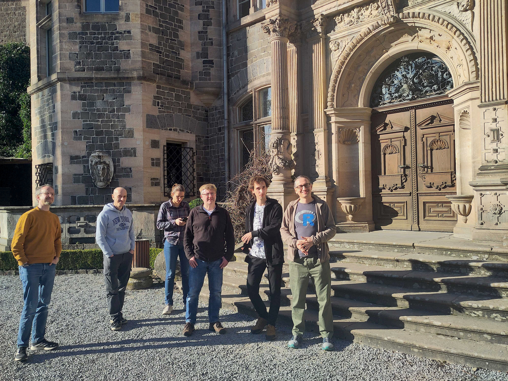

From 4 to 6 March 2026, the [REPLAY project team][team] convened for its
second annual meeting at [Schloss Rauischholzhausen][raui], a historic
19th-century hunting lodge near Giessen.

<!--more-->

With eight participants attending in person and one joining online, the
meeting provided an opportunity to review recent progress and to further
refine the project's future direction.

Particular attention was given to new functionalities in the R package
`Luminescence` and to developments in related packages from the broader
ecosystem of R packages for luminescence research, including upcoming
`RLumImage`.
Discussions also focused on REPLAY's `paraLUM` component, with particular
emphasis on establishing a freely accessible database of conversion factors
and physical constants relevant to dosimetry in luminescence dating.

Beyond these technical developments, the meeting helped define future outreach
activities, including R workshops at conferences and in online formats, as
well as the preparation of written and video tutorials.

[team]: 
[raui]: https://en.wikipedia.org/wiki/Rauischholzhausen_Castle
