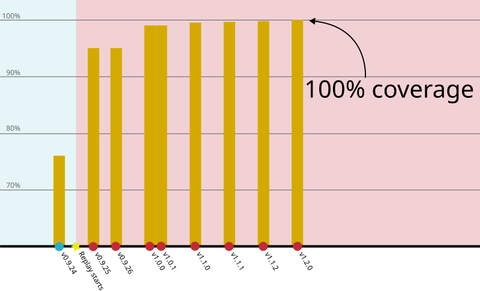
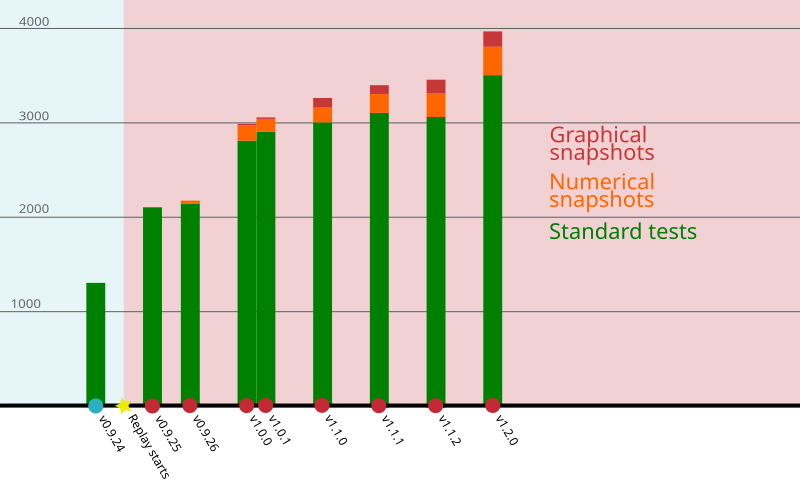

We are very excited to announce the release of **version 1.2.0** of the
[Luminescence R package][lumi]. This is a major release that, once again,
comes exactly 3 months after our [previous release][v112].

There are a lot of exciting things to discuss about this release, many of
which related to consistency in function argument names and behaviour, but
also new functionalities and some quality of life improvements. In total we
solved a total of 112 issues in 415 commits.

<!--more-->

## Breaking changes

Decisions to make breaking changes are never taken lightly, as we are aware of
the potential problems and frustration that may cause to users. However, they
are at times inevitable, if we want to make the package more consistent and
future-proof.

In many cases, it's possible for us to devise some way to keep both old and
new behaviour alive simultaneously (at least for a while), but as it happens,
this was not a possibility for the type of changes we had to introduce this
time.

Already almost two months ago we have written [a post about the breaking changes][break]
that we this release brings. So I invite you to make yourself familiar with
them, so that you'll be able to recognise if you could be affected by them.

## New functions

This release adds two new functions to the already vast set of functionality
provided by the package.

### `normalise_RLum()`

The new `normalise_RLum()` enables to normalise `RLum.Data.Curve`,
`RLum.Data.Spectrum`, `RLum.Data.Image` and `RLum.Analysis` objects in a
consistent way. This functionality is not entirely new to the package, as it
was already used in some of the plotting functions (such as
`plot_RLum.Data.Curve()`). However, it was not possible to normalise an object
for further analyses, but now the new function exposes this functionality.

A number of different normalisation methods are implemented, and can be
controlled via the `norm` argument. The default setting (which corresponds to
`norm = "max"` or `norm = TRUE`) corresponds to normalising to the highest
value, and this is what is usually meant by normalisation.

However, there are instances in which it may be helpful to normalise according
to something different, such as the minimum (`"min"`), `"first"`, or `"last"`
value; or, perhaps, according to a numerical value set manually (for example,
`norm = 1.2`).

Setting `norm = "huot"` activates a normalisation approach suggested by
Sebastien Huot, which defines a background by taking the last 20% of the
values and normalises according to:
```R
y = (y - median(background)) / (max(y) - median(background))
```

Entirely new for this release is `norm = "intensity"`, which normalises to
the channel length. This currently does not support `RLum.Data.Image` objects.

### `read_BINXLOG2R()`

Risø readers generate a log file alongside a BIN/BINX file. The log file
stores enough information to allow recovery of the BIN/BINX files if they get
lost or corrupted.

The new `read_BINXLOG2R()` function can process these log files and import
them as standard `RLum` type objects. Then, it's possible to regenerate the
BIN/BINX file with `write_R2BIN()` function.

The log file format is not well-defined, so there are a number of caveats for
this function. First of all, only TL, OSL and IRSL formats are recognised and
implemented, while all other formats will be ignored. For TL curve extraction,
the function always assumes to be dealing with BIN-files version 3, which
should be fine in general, but may become problematic for dedicated curve
analyses. Moreover, the format of the log may change without warning through
time.

Theefore the function is provided as a last-attempt resort to recover some
otherwise lost data, but with no guarantees that it will work in all cases.

## New ways of specifying integrals

In [issue 1290][i1290] we recognised that the way of setting integrals was
highly inconsistent in the package. Over the 12 functions that could deal with
integrals, we spotted in total 8 different combinations of argument names and
behaviour. Moreover, integral arguments were always validated in ad-hoc ways,
and with inconsistent level of carefulness.

For example, `analyse_SAR.CWOSL()` used to require four arguments
(`signal.integral.min`, `signal.integral.max`, `background.integral.min` and
`background.integral.max`), which could be either one or two values, with the
second value being used for the Tx curves. On the other hand, `analyse_baSAR()`
used `signal.integral` and `background.integral` (and, separately,
`signal.integral.Tx` and `background.integral.Tx`) which could be vectors.
This called for some consolidation.

In v1.2.0 the new argument names will be `signal_integral` and `background_integral`
(with `signal_integral_Tx` and `background_integral_Tx` where supported). In
all cases, they accept vector inputs. So, for example, to consider the first
5 channels for the signal and channels 900 to 1000 for the background, the
input should be specified as
```R
signal_integral = 1:5, background_integral = 900:1000
```

This uniformity allows us to validate integrals more consistently throughout
the package, having moved all the validation steps into a single internal
helper function.

This change has been quite invasive, especially as we tried to maintain
backward compatibility. This means that using the old argument names will still
work, although it will generate a deprecation warning. However, we do not
support a mix of old and new names: we don't see why anyone would want to do
that, so in that case we stop with a clear error message.

Converting from the old to the new style of arguments is in general
straightforward, and consists of two simple steps:

1. Rename the arguments: often this means replacing `.` with `_` and removing
   `.min` or `.max` from the argument name, if present.
2. Set the argument values: this requires a little more attention, as in some
   cases the old arguments used to specify the extremes, but now we need the
   whole range.

Note that now specifying `signal_integral = c(1, 5)` will trigger a warning,
as it's likely that this was meant to be `1:5`. No warning is produced if
the two values are consecutive, such as in `c(1, 2)`.

An unexpected, but very welcome, outcome of the work of converting functions
to the new style was discovering that `analyse_Al2O3C_ITC()` and
`analyse_Al2O3C_CrossTalk()` didn't actually use the integrals in the
computations. This has now been fixed, so that future computations with these
functions will be correct.

### Choosing channels according to time/temperature

Until now, with the exception of `analyse_SAR.TL()`, there was no way to
specify integrals other than by channel. However, it may be more convenient
to users to be able to specify integrals in terms of seconds or degree Celsius.

In [issue 1396][i1396], we have added the new `integral_input` option to all
functions that use integrals. This defaults to `"channels"`, but can also be
set to `"measurement"`, in which case the values given to `signal_integral`
and `background_integral` are interpreted as temperature (for TL curves) or
time (for OSL/IRSL curves). In this latter case, the values provided are
matched automatically to the measurement range of the object being analysed,
and from that we can work out the corresponding channels.

This should make life a bit easier and less error-prone in case curves were
analysed with differing channel resolutions.

## Improvements in `analyse_SAR.CWOSL()`

These are a number of noteworthy changes affecting `analyse_SAR.CWOSL()` for
the better.

The most directly user-visible is that the function  will now automatically
remove the technical curves generated when reading XSYG files. These are marked
by an `_` at the start of their `recordType` (as described in the
[breaking changes post][break]). This means that users have one fewer step to
do before being able to run the function.

The new `dose_rate_source` argument allows to specify the source dose rate
(typically Gy/s). When that is specified, doses will be converted to grays,
and plots will display values in Gy rather than seconds. This should avoid
some annoying work on the part of the user, which was previously inconvenient.

Given to enhancements in `calc_OSLLxTxRatio`, we could add a new signal-to-noise
ratio rejection criterion. The default threshold (currently at 50) can be
controlled by setting `rejection.criteria = list(sn.ratio = 75)`. It is also
possible to change the reference curve from the natural to any other curve,
for example `rejection.criteria = list(rn_reference = "R0")`.

Speaking still of rejection criteria, it is now possible to consider value
uncertainties in the computation of some rejection criteria (currently
`recycling.ratio`, `recuperation.rate` and `exceed.max.point`) by setting
`rejection.criteria = list(consider_uncertainties = TRUE)`. By default,
uncertainties are not considered to preserve the current behaviour. However,
this can be of help to distinguish cases in which an aliquot should be
rightfully rejected from cases in which the computed value has an error margin
that includes the threshold, and perhaps should not have been rejected.

## Validation of input file names

Another behind-the-scenes consolidation work concerned the validation of file
names. The `read_*()` functions behaved slightly differently with regards what
they accepted as file argument: in some cases they accepted a filename or a
list of filenames, other times multiple filenames and lists but also directory
paths, and in a few cases the input could also be a URL.

In [issue 1393][i1393] we introduced a new internal helper to validate file
names. This allowed us to uniform the checks performed and the error messages
produced. More importantly, this allowed us to make the behaviour of all import
functions more consistent.

This brought us to discover that `read_XSYG2R()` and `read_BIN2R()` had a
different approach with regard to directory traversal: when the `file` argument
listed a directory path, the first one traversed it recursively, but the
second didn't. After the consolidation work, they both work recursively.

## Test coverage at 100%

This release sees the completion of an important milestone for the project:
our test coverage has reached 100%! The chart below summarizes the progress
of the last 18 months of work, as presented during our
[second REPLAY meeting][raui].



At the start of the REPLAY project, coverage was already at 75%, which is
already very good, compared to project of similar size. With version 0.9.25,
released just over a month after the start of the project, brought coverage to
95%. By the time we released [Luminescence 1.0.0][v100], coverage was at 99.2%.

Slowly but surely, the number of lines still to reach would go down. In our
[previous release (v1.1.2)][v112], coverage was at 99.9%, which meant that
there were only 5 lines that could not be reached by our tests. With a little
code refactoring and some additional tests, we reached the long-awaited goal
of 100%.

At that point we could tighten up the test-coverage continuous integration
workflow so that it would fail whenever any line of code does not get any
coverage. We certainly didn't expect to see our first run under this new
regime to fail, but that's exactly what happened.

It turns out that our online coverage-tracking tool counted lines differently
from the `covr` package, and in reality there were still 6 lines with no
coverage, all of the form:
```R
if (condition) a else b
```

These were easily addressed, and since then we have always stayed at 100%! And
thanks to the workflow changes mentioned before, regressions of this metric
will not go unnoticed in the future.

This milestone is purely symbolic: having complete coverage doesn't mean that
our code is perfect, nor that our tests are good enough. It's just a way of
guiding the developer to pay attention to code paths that are not tested yet
or that, perhaps, at some point become redundant.

In this release there has been also a massive increase (over 13%) in number of
tests, with the numerical snapshots having grown the most (by 20%):



## Other changes

- With a number of [code][i263] [contributions][1266] by Andrzej Bluszcz,
  `read_Daybreak2R()` has been made way more correct and reliable. Before, our
  implementation was based on a very small number of example and some form of
  reverse engineering. Andrzej's insight and skill have brought new life into
  this function.

- A number of improvements have been made to `calc_MinDose()`, in particular
  with respect to its bootstrap mode. Some of the quantities computed during
  bootstrap were not correctly stored in the resulting object, and also the
  output was somewhat misleading. This led also to a number of internal fixes
  that revealed potential errors in its sister function, `calc_MaxDose()`. We
  still have some work to do to fully implement the original approach by
  Cunningham and Wallinga (2012), but this was a big already a noticeable
  improvement.

- The package no longer depends on `RcppArmadillo`. This was previously used
  because some of the most computationally expensive code in `analyse_IRSAR.RF()`
  is written in C++, and `RcppArmadillo` provided a C++ implementation of the
  `sample()` function. Due to work in [issue 1254][i1254] we've been able to
  remove this dependency, as well as halving the size of C++ object file and
  cutting the size of the `Luminescence.so` shared library by 20%.

## Get in touch!

Some of the changes discussed above (and a few more that we do not have enough
time to recount), come directly from user contributions or bug reports. So
it's important to get in touch with us whenever something doesn't quite work
according your expectations, or you believe (or just dream) that they could be
better.

Whenever flaws (however small) are pointed out to us, we not only try to fix
the issue at hand, but in doing so we often end up discovering other possible
improvements. So, don't be shy and get in touch (via [GitHub][ghub] or via
email): the gains will be experienced not only by you, but by the entire
community.

## Upcoming work

We have some new functionality planned for the next release, along with the
usual robustness and correctness fixes that we may discover as we continue
scrutinizing the package codebase. If we get to replicate what happened for
the 1.1.0 series of releases, then we have a period of relative stability (no
breaking changes!) ahead of us. Of course, plans may change and we may not be
able to keep our promise, but right now that's what the next few months look
like.


[lumi]:   https://r-lum.github.io/Luminescence/
[v112]:   
[break]:  
[i1254]:  https://github.com/R-Lum/Luminescence/issues/1254
[i1263]:  https://github.com/R-Lum/Luminescence/issues/1263
[i1266]:  https://github.com/R-Lum/Luminescence/issues/1266
[i1290]:  https://github.com/R-Lum/Luminescence/issues/1290
[i1393]:  https://github.com/R-Lum/Luminescence/issues/1393
[i1396]:  https://github.com/R-Lum/Luminescence/issues/1396
[raui]:   
[v100]:   
[ghub]:   https://github.com/R-Lum/Luminescence/issues/
