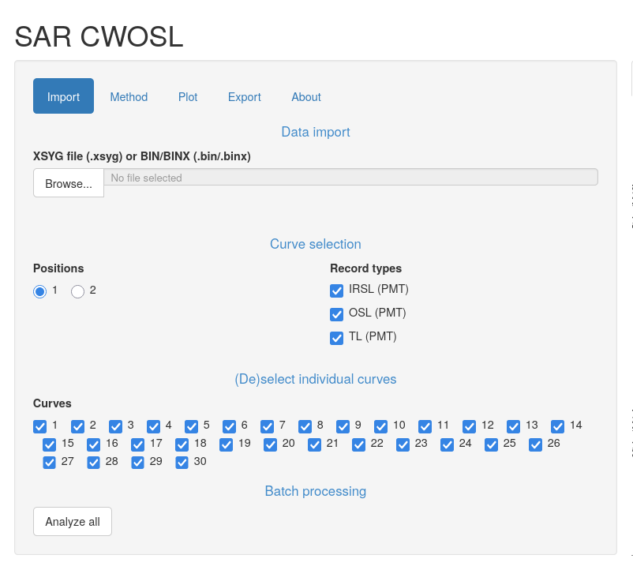
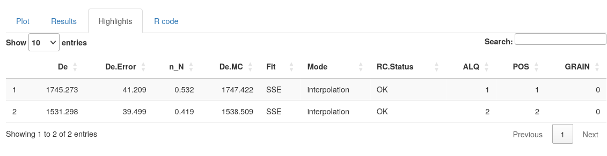
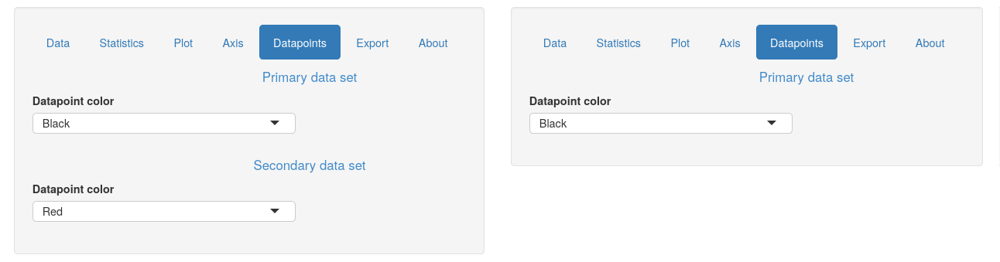
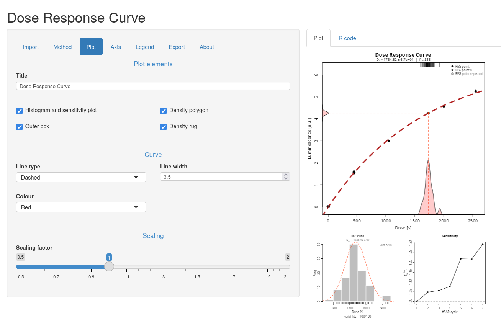

Just over seven months since [our previous release][rls027] of
[RLumShiny][rlshiny], we are pleased to announce the [release of
RLumShiny 0.2.8][rls028]. In the past months we've been chipping away at
fixing little bugs and annoyances, as well as keeping compatibility with the
[recent Luminescence 1.3.0][lum130].

While there are no new apps in this version, during we have strengthened and
improved a good number of the existing ones, especially those that were added
the last time round.

Big thanks, as always, to [Christoph Burow][tzerk] for handling the actual
release and publishing the package on CRAN.

<!--more-->

## Changes to `sarCWOSL`

The `sarCWOSL` app has seen plenty of updates and improvements:

* While in the previous release we introduced support for `XSYG` files, this
time we have added support `BIN`/`BINX` files. This vastly expands the
applicability of the app to real analyses.

* The app now allows selecting the curves to analyse directly from its user
interface. This solves one of the major drawbacks in the app, as before one
would have to do the curve selection manually in `Luminescence` before using
`RLumShiny` on the filtered object. This step can now be taken care of within
the app itself. Note, however, that for performance reasons there is a 30MB
cap on the file size, so for very large files a manual step may still be
required.

* Moreover, previously we would incorrectly merge multiple aliquots instead
of analysing them separately. That was done so that we could run the analysis
at least on simple files, and avoid unpleasant crashes when multiple aliquots
were present. However, thanks to the filtering logic introduced at the
previous point, we can now analyze files containing multiple aliquots. We have
also added a button that performs automatically the analysis on all curves
available, so that it's not necessary to click on each curve manually.

* Numerical results obtained at each position appear in tabular form under the
`Results` tab. However, as this output can be overly detailed, there is also
a `Highligths` tab that shows only a selection of the most important columns
of results.

* The app saw a few performance fixes, in that it avoids some spurious
computations that used to happen whenever a new file was loaded. In terms of
functionality, we added support for choosing the fit mode (interpolation or
extrapolation) as well as the fit method (single saturating exponential,
double saturating exponential, GOK, OTOR, linear, quadratic). We have also
added support for disabling background integral subtraction, and corrected
the setting of the maximum number of channels.

## Other changes

Several apps (`abanico`, `doserecovery`, `KDE` and `radialplot`) were refined
so that some elements of their user interface would not be shown unless really
required. Thanks to this effort, several controls related to the secondary
dataset are no longer shown when working on just a single dataset, as can be
seen for example in the `KDE` app (previous version on the left, current on
the right).

For `irsarRF` and `sarCWOSL` we also improved the performance at startup and
whenever a new file is loaded by avoiding some spurious recomputations. These
used to occur automatically even before the user clicked on any UI element,
causing an initial slowdown as well as an additional plot redrawing.

Behind the scenes, we have worked to consolidate shared functionality into
internal helpers, so that future maintainability and consistency of the code
can be more easily achieved.

The following are the most relevant app-specific changes:

* `abanico` no longer requires drawing the entire plot in a separate window
just to compute the y-axis limits.

* `doseresponsecurve` now allows to customise line type, width and colour of
the dose-response curve, and no longer crashes when exporting a plot.

* `finitemixture` no longer allows the minimum and maximum number of components
to coincide, as `Luminescence` doesn't support specifying only one component
and would throw an error.

There are exciting changes coming to `RLumShiny` in the next few months. These
will concern better interactivity (and performance) as well as a cleaner and
more modern appearance of the apps.

[rlshiny]: https://tzerk.github.io/RLumShiny/
[shiny]:   https://shiny.posit.co/
[tzerk]:   https://github.com/tzerk/
[rls027]:  
[rls028]:  https://github.com/tzerk/RLumShiny/releases/tag/v0.2.8
[lum130]:  
